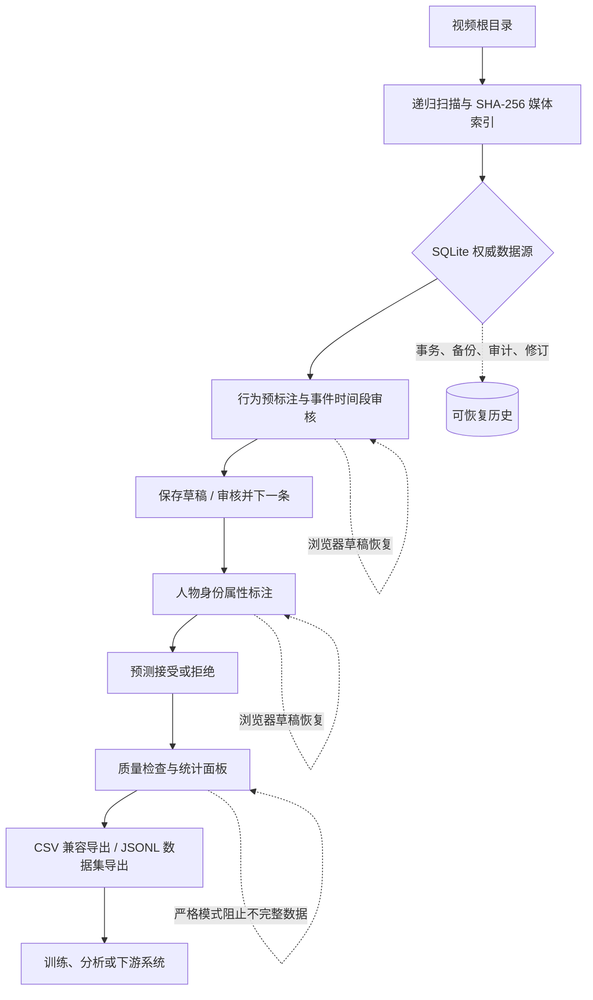

# Video Event Labeler

SQLite platform commands, schema details, and a reproducible synthetic demo are documented in `docs/architecture.md`, `docs/data-model.md`, and `docs/demo_dataset/README.md`. The current database schema is version 3.

本仓库提供一套本地优先的视频事件与人物属性标注平台：从视频目录递归建库，自动生成可人工确认的行为预标注，再由审核者补充事件时间和人物身份属性，最后导出 CSV 或 JSONL 数据集。SQLite 是正式数据源，CSV 是兼容导入/导出边界；运行时只依赖 Python 标准库。

> 项目状态：`feature/production-hardening` 已形成可独立运行的单机标注闭环，具备数据校验、并发冲突保护、审计恢复、预测审核、质量检查、备份和跨平台 CI，已经达到面试项目展示和实际小规模本地数据标注的要求。

## 功能概览

| 能力 | 已实现内容 |
| --- | --- |
| 数据导入 | 递归扫描 `.mp4`、`.avi`、`.mov`、`.mkv`、`.webm`、`.m4v`；按目录/文件名生成行为草稿；SHA-256 媒体索引 |
| 行为标注 | 多事件时间段、毫秒级起止时间、正负样本规则、循环播放、键盘导航、自定义行为标签 |
| 人物标注 | 人数、唯一 `person_id`、年龄段、人脸熟悉度、体态熟悉度；事件片段只读回看 |
| 存储可靠性 | SQLite 事务、WAL 兼容备份、文件锁、乐观修订号、外部修改/过期页面冲突检测、原子导出 |
| 审核协作 | 分页、搜索、审核状态筛选、草稿自动恢复、审核并下一条、逐样本审计历史与版本恢复 |
| 模型闭环 | 预测记录、模型版本/置信度/证据引用、接受/拒绝决策；`AnnotationProvider` 可接入真实模型，内置 `MockAnnotationProvider` 方便演示 |
| 质量与导出 | 草稿/严格质量模式、媒体失效/事件越界/重复人员检查、统计面板、CSV 兼容导出、确定性 JSONL 和 train/validation/test 划分 |
| 工程质量 | 109 个自动化测试、Ruff、Mypy、Python 3.11 的 Windows/Linux CI、路径穿越防护和 HTTP 断点续传 |

## 端到端流程



SQLite 模式下，两个浏览器页面都通过本地 HTTP 接口访问同一个数据库；CSV 模式保留旧项目的兼容工作流。视频只在配置的 `--video-root` 下读取，所有媒体路径都会经过安全解析。

## 环境

- Windows 或 Linux
- Python 3.11 或更高版本
- 一个按目录组织的视频数据集

进入仓库目录：

```powershell
cd 'D:\default file\视频标注工具'
```

## 推荐：组合启动

一次完成两个阶段：

```powershell
python .\run_video_annotation.py --video-root 'D:\videos'
```

启动器会：

1. 扫描视频目录，创建或增量更新 `video_labeler_manifest.csv`。
2. 在视频目录中默认创建或打开 `dataset.db`，并建立媒体索引。
3. 打开行为事件标注页面。
4. 行为阶段完成后，在终端按 `Ctrl+C` 停止第一阶段。
5. 自动启动人物身份标注页面。
6. 人物阶段完成后，在终端按 `Ctrl+C` 结束。

如果行为事件已经标完，只进入人物阶段：

```powershell
python .\run_video_annotation.py --video-root 'D:\videos' --person-only
```

组合启动器默认使用 8765 端口标注行为、8865 端口标注人物；端口被占用时可调整：

```powershell
python .\run_video_annotation.py --video-root 'D:\videos' --event-port 9000 --person-port 9001
```

## 分开启动

### 1. 生成清单并标注行为

```powershell
python .\video_event_labeler.py --video-root 'D:\videos'
```

行为标注脚本启动后会自动打开本地浏览器。如果浏览器没有自动打开，请复制终端打印的 `http://127.0.0.1:<port>/` 地址访问。需要手动控制浏览器时可使用：

```powershell
python .\video_event_labeler.py --video-root 'D:\videos' --no-browser
```

页面中的“导入视频文件夹”会调用系统原生文件夹选择器。若系统没有桌面会话、Tk 初始化失败或对话框被系统策略阻止，接口会返回明确提示，此时在旁边的路径框输入绝对路径并点击“按路径导入”即可继续，不影响 CSV/SQLite 导入流程。

也可以指定已有 CSV 或数据库：

```powershell
python .\video_event_labeler.py `
  --video-root 'D:\videos' `
  --csv 'D:\videos\my_manifest.csv' `
  --db 'D:\videos\dataset.db'
```

不带命令行参数时，页面支持选择视频文件夹或输入目录路径。工具会递归扫描常见格式：`.mp4`、`.avi`、`.mov`、`.mkv`、`.webm`、`.m4v`。

### 2. 标注人物身份

```powershell
python .\person_identity_labeler.py `
  --video-root 'D:\videos' `
  --db 'D:\videos\dataset.db'
```

也可使用已有 CSV（兼容模式）：

```powershell
python .\person_identity_labeler.py `
  --video-root 'D:\videos' `
  --csv 'D:\videos\video_labeler_manifest.csv'
```

人物脚本会根据每一行的 `video_path` 自动切换原视频。点击事件卡片的“播放片段”时，会从该事件的开始时间播放到结束时间并自动暂停，不会生成新视频。人物脚本只保存人物字段，行为类型、事件时间、灯光和其他字段由行为标注脚本维护。

## 推荐目录结构

```text
D:\videos\
├─ 跌倒\
│  └─ pos\
│     └─ fall-pos-001.mp4
├─ 入侵\
│  └─ neg\
│     └─ normal-neg-001.mp4
└─ video_labeler_manifest.csv
```

目录名和文件名中的行为关键词会用于预填行为标签。`pos` 表示正例，`neg` 表示负例；负例会预填 `normal_scene`。预填结果只是草稿，必须人工确认后才能审核。

## CSV 字段

新清单使用 UTF-8 with BOM 编码，字段顺序为：

```text
sample_id,video_path,lighting,lighting_evidence,behavior_class,behavior_id,security_zone_points,person_count,person_identity_attributes,events
```

| 字段 | 用途 |
| --- | --- |
| `sample_id` | 视频文件名，作为稳定记录 ID |
| `video_path` | 原视频相对路径；人物页面按此路径切换视频 |
| `lighting` | 从目录名推断的白天、黑夜或红外 |
| `lighting_evidence` | 默认 `人工确认` |
| `behavior_class` | 目录推断的行为类别 |
| `behavior_id` | 一个或多个行为标签，逗号分隔 |
| `security_zone_points` | 兼容旧格式，默认 `null` |
| `person_count` | 非负整数，允许为 `0` |
| `person_identity_attributes` | JSON 人员数组 |
| `events` | 行为事件及毫秒级起止时间 |

## 人员属性格式

`person_identity_attributes` 只保存结构化 JSON，不再生成或维护旧的 `person_tag_list` 字段。

```json
[
  {
    "person_id": "p1",
    "age_group": "adult",
    "face_familiarity": "stranger",
    "body_reid_familiarity": "unknown"
  }
]
```

可选值：

- `age_group`: `child`、`adult`、`elderly`、`unknown`
- `face_familiarity`: `familiar`、`stranger`、`unknown`、`not_visible`
- `body_reid_familiarity`: `familiar`、`stranger`、`unknown`、`not_visible`

每行人员编号必须唯一。人员数为 0 时保存为空数组 `[]`。人脸或体态无法判断时使用 `unknown` 或 `not_visible`，不要编造身份。

## 行为标注流程

1. 选择左侧记录。
2. 在视频播放器中定位事件开始位置，点击事件卡片的“截取”。
3. 定位结束位置，再点击“截取”。
4. 点击“循环片段”反复检查区间。
5. 点击“保存草稿”或“审核并下一条”。

正例事件审核时必须填写合法的开始和结束时间，且结束时间晚于开始时间。`normal_scene` 可以没有时间段，不能和正例行为混用。

## 人物标注流程

1. 选择当前记录，确认页面已经切换到对应原视频。
2. 填写人员数量；`0` 表示画面中没有需要标注的人员。
3. 为每个人填写唯一编号、年龄段、人脸熟悉度和体态熟悉度。
4. 使用事件卡片的“播放片段”检查行为区间与人物属性是否匹配。
5. 保存当前记录，或保存后切换上一条/下一条。

人物页面不会改写事件字段；如果需要调整行为或时间，请回到 `video_event_labeler.py`。

## 项目边界与可选增强

核心的本地单机标注、审核、恢复和导出能力已经完成。以下方向可以作为下一阶段迭代，但不影响当前作为面试项目或小规模本地数据标注工具使用：

- **真实模型接入**：实现 `AnnotationProvider`，并在预测生成时同时写入 `EvidenceService` 生成的证据记录；当前内置 provider 只用于可重复的演示预测。
- **浏览器端到端测试**：现有测试覆盖 HTTP 工作流、页面契约和数据层；若需要进一步展示 UI 质量，可增加 Playwright 的真实浏览器回归。
- **团队化部署**：当前服务绑定本机回环地址，适合单机使用；多用户部署需要认证、权限、任务分配和集中式数据库。
- **发布体验**：可以补充 `console_scripts` 入口、Windows 打包产物和示例数据下载，但不属于标注核心闭环。

## SQLite 维护与导出

```powershell
python -m video_labeler index-media --db 'D:\videos\dataset.db' --video-root 'D:\videos'
python -m video_labeler validate --db 'D:\videos\dataset.db' --mode strict
python -m video_labeler backup-db --db 'D:\videos\dataset.db' --output 'D:\backups\dataset.db'
python -m video_labeler check-db --db 'D:\videos\dataset.db'
python -m video_labeler export --db 'D:\videos\dataset.db' --format jsonl --output 'D:\exports\train.jsonl'
```

`backup-db` 使用 SQLite 在线备份接口，兼容 WAL；`check-db` 执行完整性检查。严格质量模式会拒绝未审核、缺失时间或无效事件，草稿模式适合持续标注。

## 安全写入与恢复

- SQLite 写入使用事务、乐观修订号和文件锁；过期页面保存会返回冲突，不覆盖新数据。
- 写入前会创建时间戳备份，并使用临时文件和原子替换，避免半写入 CSV/JSONL。
- 行为和人物页面都会自动保存未提交草稿到浏览器本地存储，刷新后可恢复。
- 从旧 CSV 迁移时会补齐 `person_count`、`person_identity_attributes`，并移除旧的 `person_tag_list`。
- 本地视频路径必须位于 `--video-root` 下，路径穿越请求会被拒绝。

恢复方式：关闭标注服务，使用 `backup-db` 生成的数据库备份或 CSV 同目录时间戳备份恢复，然后重新启动脚本。

## 常见问题

### 浏览器打不开

查看终端打印的本地地址，例如 `http://127.0.0.1:8765/`，手动复制到浏览器。也可以使用 `--no-browser` 后手动访问。

### 视频不存在

确认数据库或 CSV 的 `video_path` 是相对于 `--video-root` 的真实文件；重新运行 `index-media` 可刷新媒体状态。

### 保存提示版本冲突

关闭其他编辑页面，刷新后重新确认当前记录再保存。服务不会覆盖较新的修订。

### 需要重新扫描目录

再次运行 `video_event_labeler.py --video-root ...` 或 `index-media`。已存在记录的人工事件和人物属性会保留，新视频会增量加入。

## 测试

```powershell
python -m pytest -q
ruff check video_labeler
mypy video_labeler --exclude 'video_labeler/(storage|services|quality)'
```

## 大数据集审核、预测与质量面板

两个标注页面都支持按页加载记录，默认每页 100 条，可切换为 50 或 200 条；搜索框按样本 ID/视频文件名筛选，审核状态筛选不会改变原始数据。SQLite 模式下页面还会显示模型预测审核面板和数据质量面板：预测可直接接受或拒绝，质量面板可切换草稿/严格模式并列出缺失时间、媒体失效、重复人员编号等问题。

新增 HTTP 接口：

```text
GET /api/videos?offset=0&limit=100&q=clip&status=reviewed
GET /api/state?offset=0&limit=100&q=clip&status=reviewed
GET /api/predictions?status=draft&task=event&limit=100
GET /api/quality?mode=draft
```

SQLite 仍是预测、质量统计和分页查询的权威数据源；CSV 模式继续支持原有标注和路径导入，但质量/预测面板需要使用组合启动器或带 `--db` 的启动方式。

SQLite is the internal source of truth. Import existing manifests and export compatibility CSV files with these commands:

```powershell
python -m video_labeler import-csv --csv 'D:\videos\video_labeler_manifest.csv' --video-root 'D:\videos' --db 'D:\videos\dataset.db'
python -m video_labeler export-csv --db 'D:\videos\dataset.db' --csv 'D:\videos\video_labeler_manifest.csv' --video-root 'D:\videos'
```

The adapter accepts UTF-8/BOM CSV and common delimiters, stores unknown columns in `samples.extra_json`, derives `person_count` from `person_identity_attributes`, and computes deterministic sample/event/person identifiers. Legacy `person_tag_list` is discarded during import and never emitted on export. A changed or deleted source video is reported as `stale` while annotations remain untouched. Export writes a UTF-8 BOM CSV, a timestamped backup when needed, and `<csv>.meta.json` with schema version, UTC export time, database revision, and sample count. Malformed JSON in draft rows is retained as a draft with an import error.

测试覆盖行为预标注、CSV 迁移、原子备份、并发修改检测、人物属性校验、多视频切换、事件字段保护、HTTP 接口以及数据库备份完整性。
